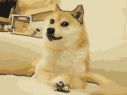

# SibaCartoon

OpenCV를 활용하여 일반 이미지를 **만화 스타일**로 변환하는 프로그램입니다.  
색상 단순화(K-means)와 윤곽선 추출(Canny Edge Detection)을 조합하여 만화 느낌을 표현합니다.

---

## ✅ 만화 스타일이 잘 표현된 예시

### 📸 원본 이미지  

### 🖌 변환 결과  

> 배경과 인물의 구분이 뚜렷하여 윤곽선이 명확하게 추출되고,  
> 색상 단순화로 인해 깔끔한 셀 애니메이션 느낌이 표현되었습니다.

---

## ❌ 만화 스타일이 잘 표현되지 않은 예시

### 📸 원본 이미지  

### 🖌 변환 결과  

> ⚠️ 인물과 배경의 색상이 유사하여 윤곽선이 제대로 추출되지 않았고,  
> 색상 분리가 불분명해 **만화 효과가 제대로 나타나지 않았습니다.**

---

## ⚠️ 알고리즘의 한계점

1. **복잡한 배경에서 윤곽선이 과도하게 추출됨**  
   Canny 알고리즘은 강한 엣지를 모두 감지하기 때문에,  
   배경이 복잡할 경우 **불필요한 윤곽선이 많아져** 지저분한 느낌이 날 수 있습니다.

2. **K-means 색상 단순화의 한계**  
   - 고해상도 이미지에서 연산 시간이 길어질 수 있습니다.  
   - 클러스터링 중심 초기화에 따라 결과가 매번 달라질 수 있고,  
   - 간혹 색상이 **부자연스럽게 나뉘는 현상**이 발생할 수 있습니다.

3. **윤곽선 두께 조절이 어려움**  
   Canny는 얇은 선만 추출되므로,  
   만화 스타일의 **굵고 강한 윤곽선 표현이 어렵습니다**.  
   (이를 위해선 Morphological 연산이 필요합니다.)

4. **조명과 대비에 민감함**  
   이미지가 어둡거나 대비가 낮은 경우 윤곽선이 **약하게 추출되며**,  
   색상 단순화 결과도 흐릿해져 **전반적인 품질이 떨어질 수 있습니다.**

